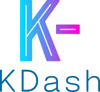
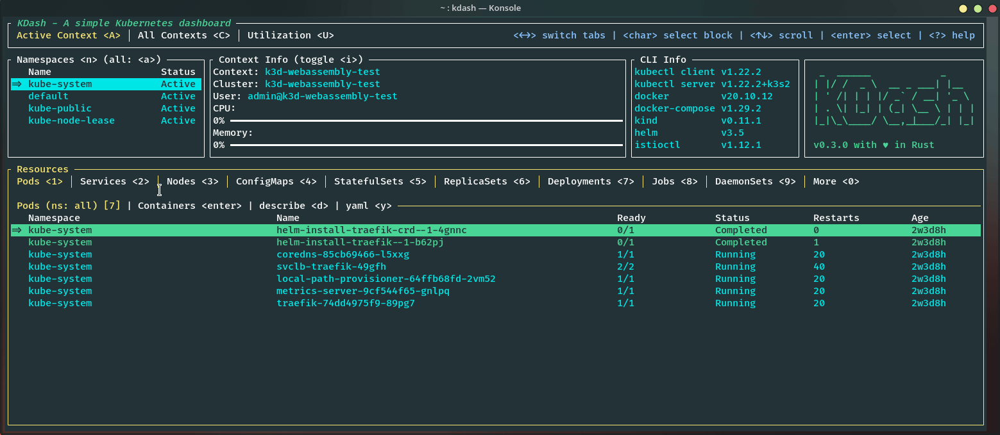
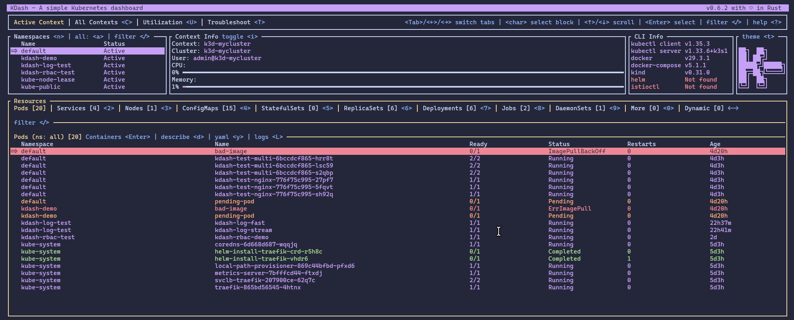
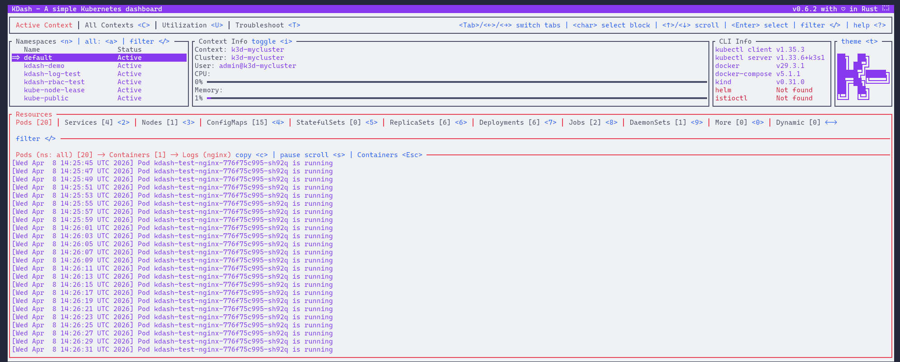
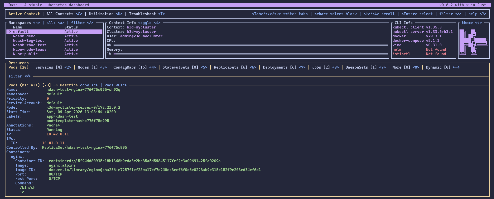
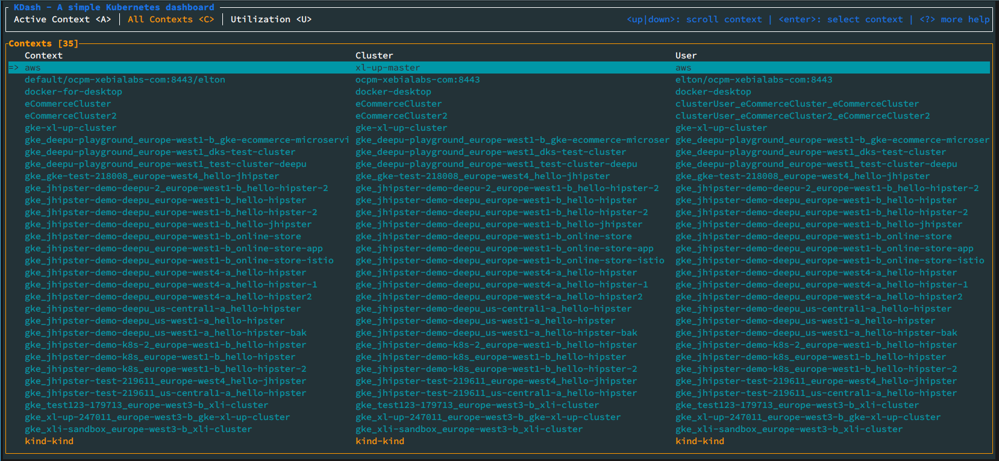
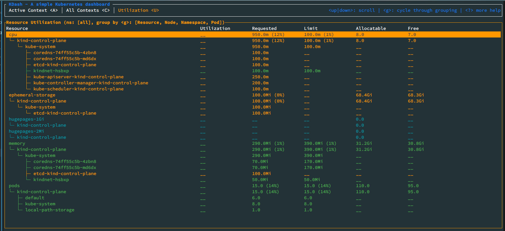

# KDash - A fast and simple dashboard for Kubernetes


[](https://crates.io/crates/kdash)


[](https://coveralls.io/github/kdash-rs/kdash?branch=main)
[](https://github.com/kdash-rs/kdash/releases)


[](https://twitter.com/intent/follow?screen_name=deepu105)



A simple terminal dashboard for Kubernetes built with Rust [](https://twitter.com/intent/follow?screen_name=kdashrs)



## Sponsors

Thanks to the sponsors of [@deepu105](https://github.com/sponsors/deepu105) who makes maintaining projects like KDash sustainable. Consider [sponsoring](https://github.com/sponsors/deepu105) if you like the work.

<!-- ### Gold

### Silver

### Bronze

- [Robusta - Kubernetes monitoring](https://home.robusta.dev/)

Gold and Silver tiers are open for [Sponsors](https://github.com/sponsors/deepu105)  -->

## Installation

### Homebrew (Mac & Linux)

```bash
brew tap kdash-rs/kdash
brew install kdash

# If you need to be more specific, use:
brew install kdash-rs/kdash/kdash
```

To upgrade

```bash
brew upgrade kdash
```

### Scoop (Windows - Recommended way)

```bash
scoop bucket add kdash-bucket https://github.com/kdash-rs/scoop-kdash

scoop install kdash
```

### Chocolatey (Windows)

Chocolatey package is located [here](https://chocolatey.org/packages/kdash).
Since validation of the package takes forever, it may take a long while to become available after a release. I would recommend using Scoop instead for Windows.

```bash
choco install kdash

# Version number may be required for newer releases, if available:
choco install kdash --version=0.4.3
```

To upgrade

```bash
choco upgrade kdash --version=0.4.3
```

### Cargo

If you have Cargo installed then you install KDash from crates.io

```bash
cargo install kdash

# if you face issues with k8s-openapi crate try the below
cargo install --locked kdash
```

You can also clone the repo and run `cargo run` or `make` to build and run the app

### Nix (Maintained by third party)

Try out kdash via `nix run nixpkgs#kdash` or add `kdash` to your
`configuration.nix` for permanent installation.

### Install script

Run the below command to install the latest binary. Run with sudo if you don't have write access to `/usr/local/bin`. Else the script will install to the current directory

```sh
curl https://raw.githubusercontent.com/kdash-rs/kdash/main/deployment/getLatest.sh | bash
```

### Manual

Binaries for macOS (x86_64, arm64), Linux GNU/MUSL(x86_64, armv6, armv7, aarch64) and Windows (x86_64, aarch64) are available on the [releases](https://github.com/kdash-rs/kdash/releases) page

1. Download the latest [binary](https://github.com/kdash-rs/kdash/releases) for your OS.
1. For Linux/macOS:
   1. `cd` to the file you just downloaded and run `tar -C /usr/local/bin -xzf downloaded-file-name`. Use sudo if required.
   1. Run with `kdash`
1. For Windows:
   1. Use 7-Zip or TarTool to unpack the tar file.
   1. Run the executable file `kdash.exe`

### Docker

Run KDash as a Docker container by mounting your `KUBECONFIG`. For example the below command for the default path

```bash
docker run --rm -it -v ~/.kube/config:/root/.kube/config deepu105/kdash
# If you want localhost access from the container
docker run --network host --rm -it -v ~/.kube/config:/root/.kube/config deepu105/kdash
```

You can also clone this repo and run `make docker` to build a docker image locally and run it using the above command

## Troubleshooting

**Note**: This may not work properly if you run Kubernetes locally using Minikube or Kind

> Note: On Debian/Ubuntu you might need to install `libxcb-xfixes0-dev` and `libxcb-shape0-dev`. On Fedora `libxcb` and `libxcb-devel` would be needed.

> Note: On Linux you might need to have package `xorg-dev` (Debian/Ubuntu) or `xorg-x11-server-devel` (Fedora) or equivalent installed for the copy to clipboard features to work

> Note: If you are getting compilation error from openSSL. Make sure perl and perl-core are installed for your OS.

## USAGE:

```bash
kdash
```

Press `?` while running the app to see keybindings

## FLAGS:

- `-h, --help`: Prints help information
- `-V, --version`: Prints version information
- `-t, --tick-rate <tick-rate>`: Set the tick rate (milliseconds): the lower the number the higher the FPS.
- `-p, --poll-rate <poll-rate>`: Set the network call polling rate (milliseconds, should be multiples of tick-rate): the lower the number the higher the network calls.
- `-d, --debug[=<debug>]`: Enables debug mode and writes logs to `kdash-debug-<timestamp>.log` file in the current directory. Default behavior is to write INFO logs. Pass a log level to overwrite the default [possible values: info, debug, trace, warn, error]

## Limitations/Known issues

- **[Linux/Docker]** Copy to clipboard feature is OS/arch dependent and might crash in some Linux distros and is not supported on `aarch64` and `arm` machines.
- **[macOS]** KDash looks better on iTerm2 since macOS's default Terminal app makes the colors render weird.
- **[Windows]** KDash looks better on CMD since Powershell's default theme makes the colors look weird.
- **[Windows]** If using k3d for local clusters, set the server URL to 127.0.0.1 as 0.0.0.0 doesn't work with kube-rs. You can use `k3d cluster create --api-port 127.0.0.1:6550` or change the `cluster.server` value in your `.kube/config` for the k3d cluster to `127.0.0.1:<port>`.

## Features

- CLI info
- Node metrics
- Resource watch (configurable polling interval with `-p` flag)
- Custom resource definitions
- Describe resources & copy the output
- Get YAML for resources & copy the output
- Stream container logs
- Context
  - Context info
  - Context watch
  - Change namespace
  - Context switch
- Resources utilizations for nodes, pods and namespaces based on metrics server. Requires [metrics-server](https://kubernetes.io/docs/tasks/debug-application-cluster/resource-metrics-pipeline/#metrics-server) to be deployed on the cluster.
- Dark/Light themes
- Sensible keyboard shortcuts
- Global glob filtering for resource names

## Screenshots

### Overview screen



### Container logs screen (light theme)



### Pod describe screen (light theme)



### Contexts screen



### Utilization screen



## Libraries used

- [ratatui](https://github.com/ratatui-org/ratatui)
- [crossterm](https://github.com/crossterm-rs/crossterm)
- [clap](https://github.com/clap-rs/clap)
- [tokio](https://github.com/tokio-rs/tokio)
- [duct.rs](https://github.com/oconnor663/duct.rs)
- [kube-rs](https://github.com/clux/kube-rs)
- [serde](https://github.com/serde-rs/serde)
- [kubectl-view-allocations](https://github.com/davidB/kubectl-view-allocations)
- [copypasta](https://github.com/alacritty/copypasta)

## How does this compare to K9S?

[K9S](https://github.com/derailed/k9s) is a beast compared to this as it offers way more features including CRUD actions.

KDash only offers a view of the resources with a focus on speed and UX. Really, if something is slow or has bad UX then please raise a bug. Hence the UI/UX is designed to be more user-friendly and easier to navigate with contextual help everywhere and a tab system to switch between different resources easily.

At least for now, there are no plans to add full CRUD for resources but in the future, we might.

## Licence

MIT

## Creator

- [Deepu K Sasidharan](https://deepu.tech/)

## [Contributors](https://github.com/kdash-rs/kdash/graphs/contributors)
