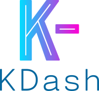
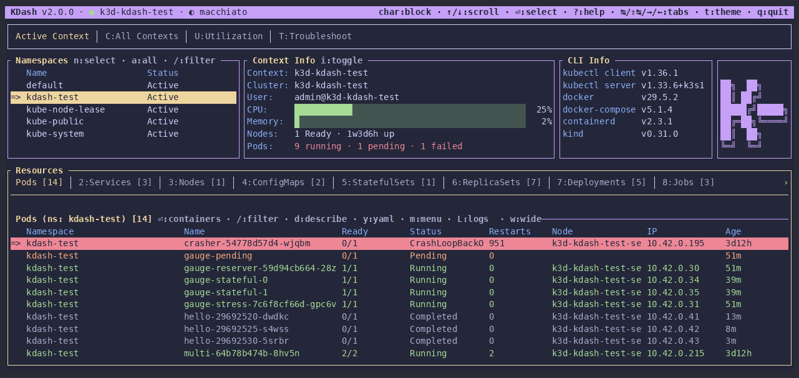
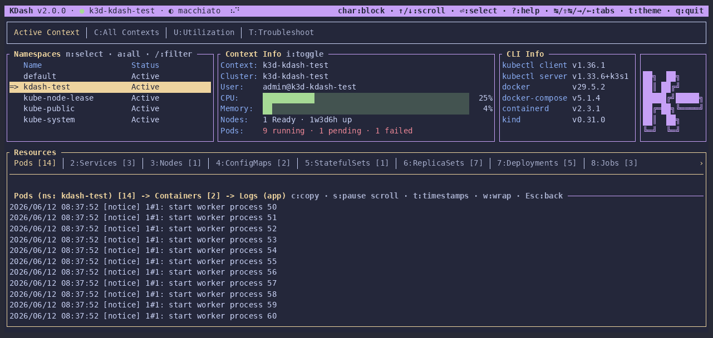
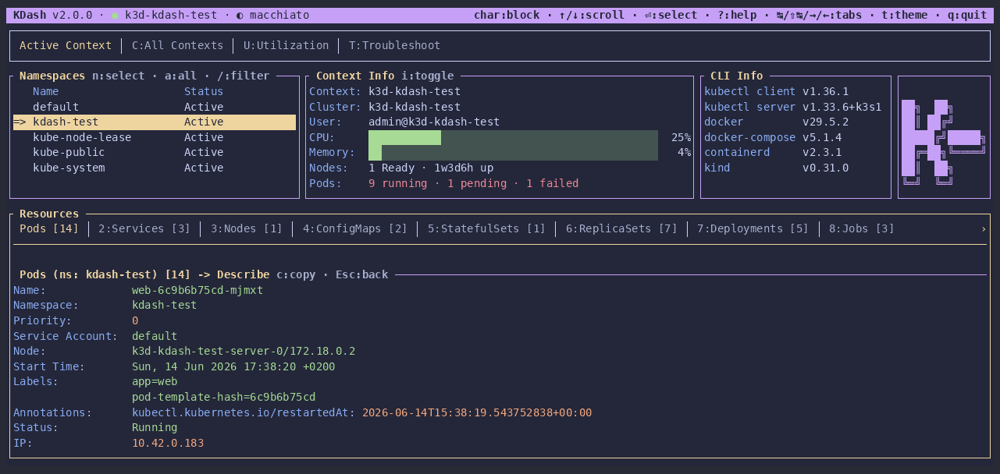
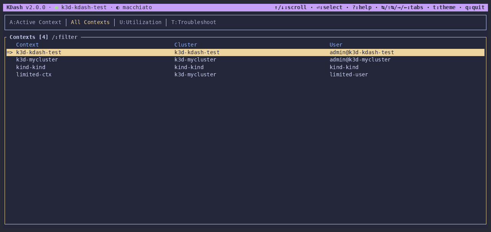
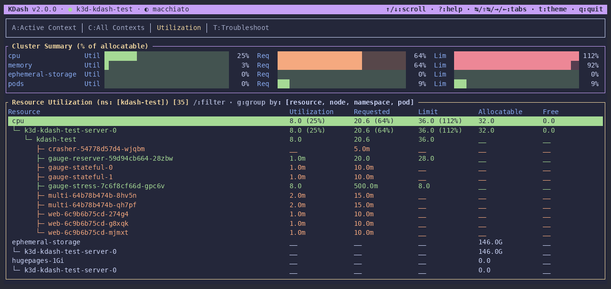

# KDash - A fast and simple dashboard for Kubernetes


[](https://crates.io/crates/kdash)


[](https://coveralls.io/github/kdash-rs/kdash?branch=main)
[](https://github.com/kdash-rs/kdash/releases)


[](https://twitter.com/intent/follow?screen_name=deepu105)



A simple terminal dashboard for Kubernetes built with Rust [](https://twitter.com/intent/follow?screen_name=kdashrs)


## Contents

- [What's new in 2.0](#whats-new-in-20)
- [Installation](#installation)
- [Usage](#usage)
- [Keybindings](#keybindings)
- [Configuration](#configuration)
- [Flags](#flags)
- [Limitations / Known issues](#limitationsknown-issues)
- [Features](#features)
- [Screenshots](#screenshots)

## What's new in 2.0

- **Resource management actions** let you act on what you're watching without leaving KDash: delete any resource (`Ctrl-d`), edit any resource in your `$EDITOR` (`e`), rollout restart workloads (`r`), view previous container logs (`p`), scale workloads, and cordon nodes or suspend/resume/trigger CronJobs from a new action menu (`m`). Impactful actions are guarded by a confirmation prompt.
- **Port-forward** a Pod or Service with `f`, then list and stop active forwards with `Shift+F`. Forwards run in the background and are stopped when you quit KDash.
- **Log view options** toggle timestamps (`t`) and line wrap (`w`) while viewing container logs.
- **More themes and runtime cycling** added Gruvbox Dark, Solarized Dark, and Mono alongside Catppuccin Macchiato and Latte, switchable on the fly with `t`/`Alt+t`, plus an optional custom theme.
- **Refreshed UI** cleans up hints, headers, help, notifications, and gauges, lays the help page out in two columns, and adds a cluster summary pane to the utilization view.

## Sponsors

Thanks to the sponsors of [@deepu105](https://github.com/sponsors/deepu105) who makes maintaining projects like KDash sustainable. Consider [sponsoring](https://github.com/sponsors/deepu105) if you like the work.

<!-- ### Gold

### Silver

### Bronze

- [Robusta - Kubernetes monitoring](https://home.robusta.dev/)

Gold and Silver tiers are open for [Sponsors](https://github.com/sponsors/deepu105)  -->

## Installation

### Homebrew (Mac & Linux)

```bash
brew tap kdash-rs/kdash
brew install kdash

# If you need to be more specific, use:
brew install kdash-rs/kdash/kdash
```

To upgrade

```bash
brew upgrade kdash
```

### Scoop (Windows - Recommended way)

```bash
scoop bucket add kdash-bucket https://github.com/kdash-rs/scoop-kdash

scoop install kdash
```

### Chocolatey (Windows)

Chocolatey package is located [here](https://chocolatey.org/packages/kdash).
Since validation of the package takes forever, it may take a long while to become available after a release. I would recommend using Scoop instead for Windows.

```bash
choco install kdash

# Version number may be required for newer releases, if available:
choco install kdash --version=2.1.0
```

To upgrade

```bash
choco upgrade kdash --version=2.1.0
```

### Arch Linux (AUR)

KDash is on the [AUR](https://aur.archlinux.org/packages?K=kdash) in two flavors. Install with an AUR helper like [`yay`](https://github.com/Jguer/yay) or [`paru`](https://github.com/Morganamilo/paru):

```bash
# Prebuilt release binary (no compile)
yay -S kdash-bin

# Build from the released source
yay -S kdash

# Build from the latest git main
yay -S kdash-git
```

### Cargo

If you have Cargo installed then you install KDash from crates.io

```bash
cargo install kdash

# if you face issues with k8s-openapi crate try the below
cargo install --locked kdash
```

You can also clone the repo and run `cargo run` or `make` to build and run the app

### Nix (Maintained by third party)

Try out kdash via `nix run nixpkgs#kdash` or add `kdash` to your
`configuration.nix` for permanent installation.

### Install script

The quickest way to grab the latest release binary without a package manager. The script downloads the right build for your platform and verifies it against the published SHA-256 checksum before installing.

**Linux and macOS** (installs to `~/.local/bin` by default, no sudo needed):

```sh
curl -fsSL https://raw.githubusercontent.com/kdash-rs/kdash/main/scripts/install.sh | sh
```

Useful flags:

- `--version vX.Y.Z`: install a specific release instead of the latest
- `--prefix <dir>`: install somewhere else, e.g. `--prefix /usr/local/bin`
- `--quiet`: only print errors

Pass flags through the pipe with `sh -s --`:

```sh
curl -fsSL https://raw.githubusercontent.com/kdash-rs/kdash/main/scripts/install.sh | sh -s -- --prefix ~/bin
```

**Windows** (installs to `%LOCALAPPDATA%\Programs\kdash`):

```powershell
irm https://raw.githubusercontent.com/kdash-rs/kdash/main/scripts/install.ps1 | iex
```

To also append the install directory to your user `PATH`, run it with `-AddToPath`:

```powershell
& ([scriptblock]::Create((irm https://raw.githubusercontent.com/kdash-rs/kdash/main/scripts/install.ps1))) -AddToPath
```

> **Note**: The older `deployment/getLatest.sh` script still works but is deprecated in favor of `install.sh`, which adds checksum verification and `--version` pinning.

### Manual

Binaries for macOS (x86_64, arm64), Linux GNU/MUSL(x86_64, armv6, armv7, aarch64) and Windows (x86_64, aarch64) are available on the [releases](https://github.com/kdash-rs/kdash/releases) page

1. Download the latest [binary](https://github.com/kdash-rs/kdash/releases) for your OS.
1. For Linux/macOS:
   1. `cd` to the file you just downloaded and run `tar -C /usr/local/bin -xzf downloaded-file-name`. Use sudo if required.
   1. Run with `kdash`
1. For Windows:
   1. Use 7-Zip or TarTool to unpack the tar file.
   1. Run the executable file `kdash.exe`

### Docker

Run KDash as a Docker container by mounting your `KUBECONFIG`. For example the below command for the default path

```bash
docker run --rm -it -v ~/.kube/config:/root/.kube/config deepu105/kdash
# If you want localhost access from the container
docker run --network host --rm -it -v ~/.kube/config:/root/.kube/config deepu105/kdash
```

You can also clone this repo and run `make docker` to build a docker image locally and run it using the above command

## Troubleshooting

**Note**: This may not work properly if you run Kubernetes locally using Minikube or Kind

> Note: On Debian/Ubuntu you might need to install `libxcb-xfixes0-dev` and `libxcb-shape0-dev`. On Fedora `libxcb` and `libxcb-devel` would be needed.

> Note: On Linux you might need to have package `xorg-dev` (Debian/Ubuntu) or `xorg-x11-server-devel` (Fedora) or equivalent installed for the copy to clipboard features to work

> Note: If you are getting compilation error from openSSL. Make sure perl and perl-core are installed for your OS.

## Usage

```bash
kdash
```

Press `?` while running the app to see keybindings.

## Keybindings

KDash is keyboard-driven. Press `?` in the app for the full, always-current list (it also reflects any overrides from your config). The common keys:

### Navigation

| Key | Action |
| --- | --- |
| `?` | Help page |
| `q` / `Ctrl-c` | Quit |
| `Esc` | Go back / close the current page |
| `↑` `↓` (or `k` `j`) | Move selection / scroll |
| `←` `→` (or `h` `l`) | Switch resource tab |
| `PgUp` `PgDn` / `Home` `End` | Scroll a page / jump to top or bottom |
| `Tab` / `Shift+Tab` | Cycle main views forward / back |
| `Ctrl-h` | Reset navigation to the root view |
| `Enter` | Select row / drill into a resource |
| `/` | Filter the current view |
| `Ctrl-r` | Refresh data |
| `1`-`0`, `-` | Jump straight to a resource tab |
| `t` / `Alt+t` | Cycle theme forward / back |

### Resource actions

| Key | Action |
| --- | --- |
| `m` | Action menu for the selected resource |
| `d` / `y` | Describe / view YAML |
| `e` | Edit in `$EDITOR` |
| `Ctrl-d` | Delete (with confirmation) |
| `r` | Rollout restart a workload |
| `p` | Previous (restarted) container logs |
| `s` | Shell into the selected container |
| `f` / `Shift+F` | Port-forward / list and stop forwards |
| `Shift+L` | Aggregate logs across a workload's pods |
| `n` / `a` | Select namespace / all namespaces |
| `i` | Show or hide the info bar |
| `w` | Toggle wide view (show all columns) |
| `x` | Decode a secret |
| `c` | Copy output to the clipboard |

### Log view

| Key | Action |
| --- | --- |
| `t` | Toggle timestamps |
| `w` | Toggle line wrap |
| `s` | Toggle auto-scroll |

## Configuration

KDash supports config-based keybinding and theme overrides, plus a configurable default for historical log lines fetched before live streaming starts.

By default it reads config from:

- `~/.config/kdash/config.yaml`

You can also point it at a specific file with:

```bash
KDASH_CONFIG=/path/to/config.yaml kdash
```

### Themes

KDash ships five built-in themes — `macchiato` (default), `latte`, `gruvbox-dark`,
`solarized-dark`, and `mono` — plus an optional user-defined `custom` theme. Cycle
through them at runtime with `t` (next) and `Alt+t` (previous).

Pick the theme KDash starts on:

```yaml
default_theme: gruvbox-dark # macchiato | latte | gruvbox-dark | solarized-dark | mono | custom
```

The semantic colour roles are: panel borders use `primary` (the focused panel's
border uses a brighter `highlight` tone), panel titles use `secondary`, inactive tabs
and help/hint text use `muted`, table column labels use `label`/blue, and body text
uses `text`. The title bar paints text in `on_accent` over the `accent` bar. Table
rows are coloured by status: healthy/active (e.g. pod `Running`, node `Ready`, bound
volumes) → `success`/green, finished (`Completed`/`Succeeded`) → `muted`/dim,
in-progress (`Pending`, `ContainerCreating`, `<pending>`) → `warning`/amber, failures
(`CrashLoopBackOff`, `Error`, `NotReady`, `Lost`/`Failed`) → `failure`/red, and rows
without a status → `text`.

Define a full `custom` theme that joins the cycle. Every slot is optional and falls
back to `base` (default `macchiato`):

```yaml
custom_theme:
  base: macchiato
  accent: "#89B4FA" # panel borders / primary
  secondary: "#F9E2AF" # panel titles
  label: "#94E2D5" # column labels
  muted: "#9399B2" # hints
  highlight: "#F5C2E7" # focused panel border
  bg: "#11111B"
  fg: "#CDD6F4"
```

Keybindings are overridden by binding name:

```yaml
keybindings:
  filter: f
  help: h
  describe_resource: i
  resource_yaml: v
```

Log streaming history can also be tuned:

```yaml
log_tail_lines: 250
```

The top status bar can also be customized:

```yaml
# Hide the KDash logo block in the top bar. Defaults to false.
hide_logo: true
# Start with the entire info bar collapsed (namespaces, context, CLI info, logo).
# Toggle it back on at any time with the `toggle_info` keybinding (default `i`). Defaults to false.
hide_info_on_start: true
```

CLI Info entries can be configured too. Built-in entries remain enabled by default, missing binaries are hidden by default, you can disable any built-in by label, and you can add custom probes with a label plus command:

```yaml
cli_info:
  hide_missing_binaries: false
  disable_defaults:
    - docker
  custom:
    - label: istioctl
      command: ["istioctl", "version"]
      regex: '\b(v?[0-9]+\.[0-9]+\.[0-9]+)\b'
```

Set `hide_missing_binaries: false` if you want missing CLIs to stay visible as `Not found`.

Built-in labels are: `kubectl client`, `kubectl server`, `docker`, `docker-compose`, `podman`, `containerd`, `helm`, and `kind`. For custom commands, `regex` is optional: if provided, the first capture group is shown; otherwise the first non-empty stdout line is shown.

See the sample config in [assets/kdash.sample-config.yaml](assets/kdash.sample-config.yaml) for a complete example with both custom keybindings and custom light/dark theme overrides.

## Flags

- `-h, --help`: Prints help information
- `-V, --version`: Prints version information
- `-t, --tick-rate <tick-rate>`: Set the tick rate (milliseconds): the lower the number the higher the FPS.
- `-p, --poll-rate <poll-rate>`: Set the network call polling rate (milliseconds, should be multiples of tick-rate): the lower the number the higher the network calls.
- `--log-tail-lines <log-tail-lines>`: Set how many historical log lines to fetch before live streaming starts.
- `-n, --namespace <name>`: Pre-select a namespace on startup (same as pressing `n` and picking the namespace).
- `-c, --context <name>`: Pre-select a kubeconfig context on startup (same as picking it from the Contexts view).
- `-d, --debug[=<debug>]`: Enables debug mode and writes logs to `kdash-debug-<timestamp>.log` file in the current directory. Default behavior is to write INFO logs. Pass a log level to overwrite the default [possible values: info, debug, trace, warn, error]

## Limitations/Known issues

- **[Linux/Docker]** Copy to clipboard feature is OS/arch dependent and might crash in some Linux distros and is not supported on `aarch64` and `arm` machines.
- **[macOS]** KDash looks better on iTerm2 since macOS's default Terminal app makes the colors render weird.
- **[Windows]** KDash looks better on CMD since Powershell's default theme makes the colors look weird.
- **[Windows]** If using k3d for local clusters, set the server URL to 127.0.0.1 as 0.0.0.0 doesn't work with kube-rs. You can use `k3d cluster create --api-port 127.0.0.1:6550` or change the `cluster.server` value in your `.kube/config` for the k3d cluster to `127.0.0.1:<port>`.

## Features

- **CLI info** shows local tool versions (kubectl, docker, helm, and more). Disable built-in probes or add custom commands with optional regex-based version extraction.
- **Live resource watch** polls and refreshes Kubernetes resources at a configurable interval (`-p` flag).
- **Custom resource definitions** are discovered and browsable alongside built-in kinds.
- **Describe and YAML views** for any resource, with syntax highlighting and copy to clipboard.
- **Container logs** stream live with toggles for timestamps (`t`) and line wrap (`w`), and can aggregate logs from every pod owned by a workload into one stream.
- **Deep drill-down navigation** moves from workloads to owned Pods, from Pods to Containers, and from Nodes to the Pods scheduled on them.
- **Shell into a container** from the Containers view. KDash suspends the UI while the shell is active and restores it when you exit.
- **Resource management actions**, each guarded by a confirmation prompt for impactful changes:
  - Delete any resource (`Ctrl-d`)
  - Edit any resource in your `$EDITOR` (`e`)
  - View previous (restarted) container logs (`p`)
  - Rollout restart Deployments/StatefulSets/DaemonSets (`r`)
  - Scale Deployments/StatefulSets/ReplicaSets/ReplicationControllers to a replica count (via the action menu)
  - Cordon/uncordon nodes, suspend/resume/trigger CronJobs (via the action menu)
- **Port-forward** a Pod or Service (`f`), then list and stop active forwards (`Shift+F`).
- **Action menu** (`m`) lists every action available for the selected resource; the most-used ones also have dedicated hotkeys shown as hints.
- **Troubleshoot tab** surfaces severity-ranked findings for Pods, PVCs, and ReplicaSets, then lets you jump straight into containers, logs, describe, and YAML.
- **Events tab** shows Kubernetes events with namespace, involved kind, reason, count, message, and age, with the same describe/YAML workflows as other resources.
- **Context management** shows context info, watches for changes, and lets you switch context or change namespace.
- **Resource metrics and utilization** for nodes, pods, and namespaces, with grouping. Requires [metrics-server](https://kubernetes.io/docs/tasks/debug-application-cluster/resource-metrics-pipeline/#metrics-server) on the cluster.
- **Resource tables** show counts in tabs and menus (hiding zero-count badges), cache counts with `?` for not-yet-fetched Dynamic kinds, and reveal all columns with `w` when the viewport is wide enough.
- **Inline `/` filtering** works across resource tables and views, including Contexts, Help, Utilization, Troubleshoot, More, and Dynamic resource menus.
- **Built-in themes** include Catppuccin Macchiato/Latte, Gruvbox Dark, Solarized Dark, and Mono, plus an optional custom theme, cycled at runtime with `t`/`Alt+t`.
- **Configurable and keyboard-driven** with sensible default shortcuts you can override, theme overrides, and a configurable initial log history (`log_tail_lines`).
- **Diagnostics and reliability** include dumping recent errors to a file, live kubeconfig reload, friendlier error messages, and smooth log and render performance.

## Screenshots

### Overview screen



### Container logs screen (light theme)



### Pod describe screen (light theme)



### Contexts screen



### Utilization screen



## Libraries used

- [ratatui](https://github.com/ratatui-org/ratatui)
- [crossterm](https://github.com/crossterm-rs/crossterm)
- [clap](https://github.com/clap-rs/clap)
- [tokio](https://github.com/tokio-rs/tokio)
- [duct.rs](https://github.com/oconnor663/duct.rs)
- [kube-rs](https://github.com/clux/kube-rs)
- [serde](https://github.com/serde-rs/serde)
- [kubectl-view-allocations](https://github.com/davidB/kubectl-view-allocations)
- [copypasta](https://github.com/alacritty/copypasta)

## Licence

MIT

## Terms of use

- The Software shall be used for Good, not Evil.
- This software shall not be used for any military purposes including intelligence agencies.

## Creator

- [Deepu K Sasidharan](https://deepu.tech/)

## [Contributors](https://github.com/kdash-rs/kdash/graphs/contributors)
