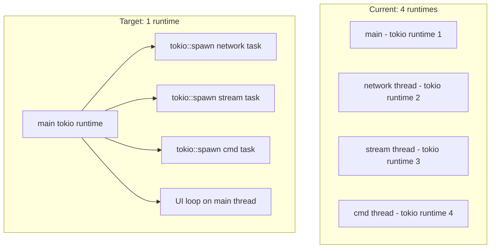

# fix: Address P0 and P1 Review Findings

## Overview

Fix the 8 highest-severity findings from the full codebase review: 3 critical (P0) issues affecting correctness and stability, and 5 high-impact (P1) issues affecting reliability and user experience.

## Problem Frame

The kdash codebase review identified critical issues including: multiple independent tokio runtimes wasting resources and preventing task cooperation (P0), a mutex held across the entire UI render cycle blocking all network threads (P0), `unwrap()` calls that can crash the app on terminal errors (P0), unbounded log buffer causing memory leaks (P1), panicking secret decode on non-UTF8 data (P1), sensitive data in INFO-level logs (P1), potential command injection in kubectl describe (P1), and excessive API calls on startup (P1).

## Requirements Trace

- R1. Eliminate multiple tokio runtimes — use a single shared runtime for all async tasks
- R2. Reduce mutex contention so network threads are not blocked during UI rendering
- R3. Handle terminal event errors gracefully instead of panicking
- R4. Bound the log buffer to prevent unbounded memory growth
- R5. Handle non-UTF8 secret data without panicking
- R6. Prevent sensitive kubeconfig data from appearing in INFO-level logs
- R7. Validate/sanitize kubectl describe arguments
- R8. Reduce startup API load by lazy-loading resources

## Scope Boundaries

- P2 and P3 findings (boilerplate reduction, naming, commented code) are explicitly excluded
- No new features or UI changes
- Existing test suite must continue to pass
- No changes to the public CLI interface or keybindings

## Context & Research

### Relevant Code and Patterns

- `src/main.rs` — Entry point with 4x `#[tokio::main]`, UI loop at line 202, panic hooks
- `src/app/mod.rs` — `App` struct, `dispatch()` / `dispatch_stream()` / `dispatch_cmd()` methods, `on_tick()`, `cache_all_resource_data()`
- `src/app/models.rs` — `LogsState` with unbounded `VecDeque`, `ScrollableTxt`
- `src/network/mod.rs` — `Network` struct, `handle_network_event()`, `get_client()` with INFO logging
- `src/network/stream.rs` — `NetworkStream`, `stream_container_logs()` with lock-in-loop
- `src/cmd/mod.rs` — `CmdRunner`, `get_describe()` passing user-influenced args to kubectl
- `src/event/events.rs` — `Events` thread with `unwrap()` on `poll`/`read`
- `src/app/secrets.rs` — `decode_secret()` with `String::from_utf8().unwrap()`
- Tests are inline `#[cfg(test)]` modules in 33 files; `src/app/mod.rs::tests` has the main `on_tick` tests

### Existing Patterns

- Error handling via `anyhow::Result` and `app.handle_error()`
- Channels via `tokio::sync::mpsc` for inter-thread communication
- State shared via `Arc<Mutex<App>>` (tokio mutex)
- Existing tests mock channels and assert event sequences

## Key Technical Decisions

- **Consolidate to single tokio runtime**: Replace `std::thread::spawn` + `#[tokio::main]` with `tokio::spawn` on the main runtime. The main runtime already has `rt-multi-thread` enabled. This is the idiomatic tokio approach.

- **Reduce mutex scope in UI loop, don't eliminate Arc<Mutex>**: A full architecture switch to message-passing (UI owns state, network sends updates via channel) would be ideal but is too large for this plan. Instead, minimize how long the UI holds the lock by splitting the draw phase from the event-handling phase.

- **Bound logs with configurable max**: Use a constant (e.g., `MAX_LOG_RECORDS = 10_000`) and evict oldest records. This matches the existing TODO in the codebase.

- **Lazy-load instead of cache-all**: On startup, only fetch namespaces, nodes, and the default active tab (pods). Other resources load when their tab is first activated. This preserves the current UX while dramatically reducing startup API calls.

- **Event thread error handling via channel**: Instead of unwrapping, send error events through the existing channel or break the loop and let the UI detect the closed channel.

## Open Questions

### Resolved During Planning

- **Should we switch to RwLock instead of Mutex?**: No. The UI needs `&mut App` for rendering (ratatui takes `&mut` in draw closures), so readers would still conflict. The real win is reducing lock duration.
- **Should lazy-loading be configurable?**: No. The current behavior (fetching everything) was never configurable. The new behavior is strictly better for all users.

### Deferred to Implementation

- **Exact lock scope boundaries in UI loop**: The precise split between "read state for draw" and "handle events" may need adjustment based on what ratatui's `draw()` closure actually mutates. This should be discovered during implementation.
- **Whether `cache_all_resource_data` should be removed or kept as a fallback**: It's called on namespace selection too. Implementation should determine if lazy-load can fully replace it or if a subset is still needed.

## High-Level Technical Design

> *This illustrates the intended approach and is directional guidance for review, not implementation specification. The implementing agent should treat it as context, not code to reproduce.*

The key insight: `tokio::spawn` runs tasks on the same runtime's thread pool, while `std::thread::spawn` + `#[tokio::main]` creates entirely separate runtimes. Since the app already uses `tokio::sync::mpsc` channels (which work across tasks on the same runtime), the migration is straightforward.

## Implementation Units

### Phase 1: Critical Fixes (P0)

- [ ] **Unit 1: Consolidate to single tokio runtime**

**Goal:** Eliminate 3 redundant tokio runtimes by running network, stream, and cmd handlers as spawned tasks on the main runtime.

**Requirements:** R1

**Dependencies:** None

**Files:**
- Modify: `src/main.rs`
- Test: `src/app/mod.rs` (existing `test_on_tick_*` tests)

**Approach:**
- Remove `#[tokio::main]` from `start_network`, `start_stream_network`, and `start_cmd_runner`
- Convert them to regular async functions
- Replace `std::thread::spawn` calls with `tokio::spawn` in `main()`
- The functions currently take `&Arc<Mutex<App>>` — for `tokio::spawn` they need `'static` lifetime, so pass `Arc::clone()` and move it into the async block
- The `get_client` calls inside these functions are already async and will work on the shared runtime

**Patterns to follow:**
- The existing `start_ui` function is already an async function called from the main runtime — follow its pattern

**Test scenarios:**
- Existing `test_on_tick_first_render` and `test_on_tick_refresh_tick_limit` tests must pass (they test the channel communication that this change affects)
- App should start without errors and successfully poll Kubernetes resources
- Manual smoke test: launch the app, switch tabs, verify data loads

**Verification:**
- `cargo build` succeeds
- `cargo test` passes
- Only one tokio runtime is created (observable by removing the `rt-multi-thread` feature temporarily — if things still work, there's only one runtime)

---

- [ ] **Unit 2: Reduce mutex lock duration in UI loop**

**Goal:** Minimize how long the UI loop holds the `App` mutex so network threads can update state between frames.

**Requirements:** R2

**Dependencies:** Unit 1 (runtime consolidation makes lock contention more acute since everything shares one runtime)

**Files:**
- Modify: `src/main.rs` (the `start_ui` function, specifically the main loop)

**Approach:**
- Split the current loop body which holds the lock for the entire iteration
- Lock, handle terminal size update, draw the UI, then drop the lock
- Re-acquire the lock for event handling (which may dispatch network events)
- The key constraint: `terminal.draw(|f| ui::draw(f, &mut app))` needs `&mut App`, so the lock must be held during draw. But it can be released between draw and the next event poll.
- Move `events.next()` call BEFORE acquiring the lock — this is where the loop blocks waiting for input/tick, and there's no reason to hold the lock while waiting

**Patterns to follow:**
- The existing pattern of `let mut app = app.lock().await` but applied more granularly

**Test scenarios:**
- UI rendering still works correctly (manual test)
- Network data updates are visible in the UI without excessive lag
- Existing handler tests pass unchanged

**Verification:**
- App remains responsive during heavy network polling
- No deadlocks under normal usage (switch contexts, stream logs, browse tabs)

---

- [ ] **Unit 3: Handle terminal event errors gracefully**

**Goal:** Replace `unwrap()` calls in the event polling thread with graceful error handling.

**Requirements:** R3

**Dependencies:** None (independent of Units 1-2)

**Files:**
- Modify: `src/event/events.rs`

**Approach:**
- Replace `event::poll(timeout).unwrap()` with a match that treats errors as "no event available" (log and continue)
- Replace `event::read().unwrap()` with a match that logs and continues on error
- If `send()` on the channel fails (receiver dropped), break the loop — this means the app is shutting down
- Consider adding a dedicated error variant to the `Event` enum, or simply break the loop on persistent errors

**Patterns to follow:**
- The `handle_error` pattern used in `Network` and `CmdRunner` — but since this thread doesn't have access to the app, prefer logging and breaking

**Test scenarios:**
- Normal key and mouse events still flow through correctly
- If `event::read` returns an error, the thread doesn't panic
- If the channel receiver is dropped (app shutting down), the event thread exits cleanly

**Verification:**
- No `unwrap()` calls remain in `src/event/events.rs` outside of test code
- `cargo clippy` passes
- App starts and handles input normally

---

### Phase 2: High-Impact Fixes (P1)

- [ ] **Unit 4: Bound the log buffer**

**Goal:** Prevent unbounded memory growth in `LogsState` by capping the record buffer.

**Requirements:** R4

**Dependencies:** None

**Files:**
- Modify: `src/app/models.rs` (`LogsState` struct and `add_record` method)
- Test: `src/app/models.rs` (existing `test_logs_state` test, add new case)

**Approach:**
- Add a `MAX_LOG_RECORDS` constant (10,000 is a reasonable default — enough for scrollback without unbounded growth)
- In `add_record()`, after pushing, check if `records.len() > MAX_LOG_RECORDS` and `pop_front()` to evict oldest
- The `VecDeque` already started with `with_capacity(512)` — increase this to something reasonable like 1024, but the max enforces the bound
- When evicting, also invalidate the cached wrapped lines (they reference the evicted record's data)

**Patterns to follow:**
- The existing `VecDeque` usage in `LogsState`

**Test scenarios:**
- Adding more than `MAX_LOG_RECORDS` entries results in exactly `MAX_LOG_RECORDS` records
- The oldest records are evicted first
- `get_plain_text()` returns only the retained records
- Rendering still works correctly after eviction

**Verification:**
- New test case passes demonstrating the bound
- Existing `test_logs_state` still passes
- Memory usage stabilizes when streaming high-volume pod logs (manual verification)

---

- [ ] **Unit 5: Fix secret decode panic on non-UTF8 data**

**Goal:** Handle binary secret values without panicking.

**Requirements:** R5

**Dependencies:** None

**Files:**
- Modify: `src/app/secrets.rs` (`decode_secret` method)
- Test: `src/app/secrets.rs` (existing tests, add binary data case)

**Approach:**
- Replace `String::from_utf8(decoded_bytes).unwrap()` with `String::from_utf8_lossy(&decoded_bytes).into_owned()`
- This replaces invalid UTF-8 sequences with the Unicode replacement character, which is the standard approach for displaying potentially binary data

**Patterns to follow:**
- The existing error handling in `decode_secret` that already handles base64 decode failures with a descriptive message

**Test scenarios:**
- Decoding a secret with valid UTF-8 values works as before
- Decoding a secret with binary data (e.g., raw bytes that aren't valid UTF-8) produces output with replacement characters instead of panicking
- Existing `test_decode_secret` in `src/handlers/mod.rs` still passes

**Verification:**
- No `unwrap()` on `from_utf8` in `src/app/secrets.rs`
- New test with binary data passes
- Existing tests unchanged

---

- [ ] **Unit 6: Reduce log level for sensitive kubeconfig data**

**Goal:** Prevent kubeconfig paths and client config from appearing at INFO level.

**Requirements:** R6

**Dependencies:** None

**Files:**
- Modify: `src/network/mod.rs` (`get_client` and `get_kube_config` functions)

**Approach:**
- Change `info!("env KUBECONFIG: ...")` to `debug!`
- Change `info!("Kubernetes client config: ...")` to `debug!`
- Change `info!("Using Kubeconfig: ...")` in `get_kube_config` to `debug!`
- Keep context message at INFO level but strip the config content: `info!("Kubernetes client connected")` instead of dumping the full config struct

**Patterns to follow:**
- The existing `info!("Starting network thread")` pattern — keep structural messages at INFO, move data-bearing messages to DEBUG

**Test scenarios:**
- With default INFO logging, no kubeconfig content appears in log files
- With DEBUG logging explicitly enabled, kubeconfig info is still accessible
- App startup and context switching still work

**Verification:**
- `grep -n 'info!.*config\|info!.*KUBECONFIG\|info!.*Kubeconfig' src/network/mod.rs` returns no matches
- App starts correctly with and without debug mode

---

- [ ] **Unit 7: Harden kubectl describe argument handling**

**Goal:** Validate resource kind and name arguments before passing to kubectl.

**Requirements:** R7

**Dependencies:** None

**Files:**
- Modify: `src/cmd/mod.rs` (`get_describe` method)
- Test: `src/cmd/mod.rs` (add validation test)

**Approach:**
- Add basic validation: reject kind/value strings containing newlines, null bytes, or shell metacharacters
- The `duct::cmd` approach already prevents shell injection (args are passed directly, not through a shell), so this is defense-in-depth
- If validation fails, return an error via `handle_error` instead of executing kubectl
- Also validate the namespace argument

**Patterns to follow:**
- The existing `handle_error` pattern in `CmdRunner`

**Test scenarios:**
- Normal resource names pass validation and describe works
- Resource name containing newline is rejected with an error message
- Resource name containing null byte is rejected
- Namespace containing special characters is rejected

**Verification:**
- New test cases pass
- Existing `test_get_info_by_regex` still passes
- Normal describe workflow still works (manual test)

---

- [ ] **Unit 8: Lazy-load resources instead of fetching all on startup**

**Goal:** Reduce startup API calls from 24 to ~4 by only fetching data for the visible tab.

**Requirements:** R8

**Dependencies:** Units 1-2 (benefits from the runtime consolidation and reduced lock contention)

**Files:**
- Modify: `src/app/mod.rs` (`cache_all_resource_data`, `on_tick`, `dispatch_by_active_block`)
- Test: `src/app/mod.rs` (modify `test_on_tick_first_render` to assert fewer initial events)

**Approach:**
- Replace `cache_all_resource_data()` in the startup/refresh path with a targeted set: only fetch namespaces, nodes, pods (default tab), and discover dynamic resources
- When `on_tick` fires a periodic refresh for an active block that has never been fetched, it will trigger the first fetch via the existing `dispatch_by_active_block` mechanism — this already works for periodic refresh, it just needs to also serve as the initial fetch
- Keep `cache_all_resource_data()` as a method but only call it on explicit namespace selection (where the user expects all data to refresh for the new namespace)
- The `is_routing` flag already triggers `dispatch_by_active_block` when tabs change — this provides the "load on first visit" behavior naturally

**Patterns to follow:**
- The existing `dispatch_by_active_block` which already maps `ActiveBlock` to the correct `IoEvent`
- The existing `on_tick` which already calls `dispatch_by_active_block` for the active route

**Test scenarios:**
- On first render, only ~4 events are dispatched (namespaces, nodes, pods, discover dynamic) instead of 24+
- Switching to Services tab triggers `GetServices` event
- Namespace selection still triggers full data refresh
- Periodic polling for the active tab still works

**Verification:**
- Modified `test_on_tick_first_render` passes with the reduced event set
- App starts noticeably faster on clusters with many resources
- All tabs still show data after being visited

## System-Wide Impact

- **Interaction graph:** Units 1-2 change how `main.rs` orchestrates threads/tasks and the mutex lifecycle. All callers of `app.lock().await` are affected by the contention changes. The `Events` thread (Unit 3) is independent.
- **Error propagation:** Currently, thread panics may not propagate cleanly to the UI. After Unit 1, `tokio::spawn` task panics will be caught by the JoinHandle (if used) or silently absorbed. After Unit 3, event thread errors will cause the event loop to stop, which the UI can detect via channel closure.
- **State lifecycle risks:** Unit 2 introduces a brief window between UI draw and event handling where network threads can update state. This is actually an improvement — it means the UI see fresher data. But it means the state shown in the current frame may differ from the state used for event handling. This is acceptable for a TUI dashboard.
- **Integration coverage:** Start the app against a real cluster, switch contexts, view logs, decode secrets with binary data, and confirm no panics or data loss. Unit tests cover event sequencing but not end-to-end.

## Risks & Dependencies

- **Unit 1 runtime change is the most impactful**: If any code depends on having separate runtimes (e.g., thread-local state), it could break. Review showed no such dependencies.
- **Unit 2 mutex scope change could introduce subtle bugs**: If the UI draw mutates state that event handling depends on reading in the same frame. Mitigated by the existing pattern where draw and event handling are already sequential.
- **Unit 8 lazy-loading changes test expectations**: The `test_on_tick_first_render` test asserts exact event sequences. It will need updating, which is expected.

## Sources & References

- **Origin document:** [REVIEW.md](../../REVIEW.md)
- Related code: `src/main.rs`, `src/app/mod.rs`, `src/app/models.rs`, `src/network/mod.rs`, `src/event/events.rs`, `src/app/secrets.rs`, `src/cmd/mod.rs`
- Tokio docs on shared runtime: https://tokio.rs/tokio/tutorial/spawning
